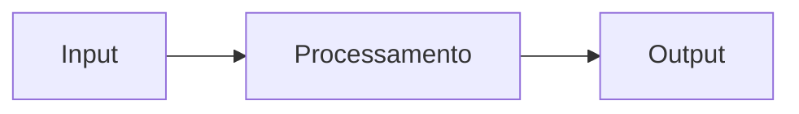

# project-template

Template base para novos projetos — CI, releases automáticas, changelog, commitlint, Husky e estrutura de documentação prontos para uso.

---

## O que está incluído

| Arquivo | Função |
|---------|--------|
| `.github/workflows/ci.yml` | Push em `feature/**` ou `bug/**` → PR automático para `develop` |
| `.github/workflows/promote.yml` | Merge em `develop` → PR automático para `main` |
| `.github/workflows/release.yml` | Merge em `main` → bump de versão, changelog, release, notifica portfolio-hub |
| `package.json` | Scripts de changelog e commitizen |
| `.commitlintrc.json` | Enforça Conventional Commits em cada commit local |
| `.husky/commit-msg` | Hook que bloqueia commits fora do padrão |
| `.editorconfig` | Consistência de indentação e encoding entre editores |
| `.prettierrc.json` | Formatação de código padronizada |
| `.gitignore` | Ignora `node_modules`, `dist`, `.env` e afins |
| `docs/` | Estrutura base de documentação |
| `CHANGELOG.md` | Gerado e mantido automaticamente pelo CI |

---

## Como usar

### 1. Criar o repositório a partir do template

No GitHub, acesse [MatheusAzevedoDev/project-template](https://github.com/MatheusAzevedoDev/project-template) e clique em **Use this template → Create a new repository**.

Crie o repositório dentro da organização **MatheusAzevedoDev** para herdar o `PORTFOLIO_TOKEN` automaticamente.

### 2. Clonar e instalar

```bash
git clone https://github.com/MatheusAzevedoDev/seu-projeto
cd seu-projeto
npm install
```

O `npm install` ativa o Husky automaticamente via script `prepare`.

### 3. Configurar o `package.json`

Atualize os campos do projeto no `package.json`:

```json
{
  "name": "seu-projeto",
  "displayName": "Seu Projeto",
  "version": "0.1.0",
  "description": "Descrição breve e impactante",
  "tags": ["go", "api", "docker"]
}
```

Esses valores são enviados automaticamente ao portfolio-hub em cada release.

### 4. (Opcional) Criar `projects/seu-projeto.json` no portfolio-hub

O arquivo é **criado automaticamente** na primeira release. Você pode criá-lo manualmente antes se quiser que o projeto apareça no hub imediatamente com um status específico:

```json
{
  "name": "seu-projeto",
  "display_name": "Seu Projeto",
  "description": "Descrição breve e impactante",
  "version": "0.1.0",
  "tags": ["go", "api", "docker"],
  "repo_url": "https://github.com/MatheusAzevedoDev/seu-projeto",
  "status": "wip",
  "docs_updated_at": "",
  "changelog_updated_at": ""
}
```

---

## Fluxo completo

```
feature/foo  ou  bug/foo
       │
       │  push → ci.yml verifica o código
       │          PR automático aberto para develop
       ▼
    develop
       │
       │  merge → promote.yml
       │          PR automático aberto para main
       ▼
     main  (produção)
       │
       │  merge → release.yml
       │          bump de versão detectado pelos commits
       │          CHANGELOG.md gerado
       │          tag vX.Y.Z criada e push
       │          release publicada no GitHub
       │          repository_dispatch: project-update → portfolio-hub
       ▼
  portfolio-hub atualizado → GitHub Pages redeploy
```

A branch `develop` é criada automaticamente pelo CI na primeira vez que uma branch `feature/` ou `bug/` recebe um push.

---

## Fazendo commits

Sempre trabalhe em branches com prefixo `feature/` ou `bug/`:

```bash
git checkout -b feature/minha-funcionalidade
git checkout -b bug/corrige-timeout
```

Use o padrão **Conventional Commits**:

```bash
git commit -m "feat: adiciona endpoint de autenticação"
git commit -m "fix: corrige timeout na conexão com o banco"
git commit -m "docs: atualiza guia de uso"
```

Ou use o Commitizen para um assistente interativo:

```bash
npm run commit
```

### Tipos de commit

| Tipo | Aparece no changelog | Quando usar |
|------|---------------------|-------------|
| `feat` | sim — Features | Nova funcionalidade |
| `fix` | sim — Bug Fixes | Correção de bug |
| `perf` | sim — Performance | Melhoria de performance |
| `docs` | não | Somente documentação |
| `refactor` | não | Refatoração sem mudança funcional |
| `test` | não | Testes |
| `chore` | não | Build, dependências, CI |

O escopo entre parênteses é opcional:

```bash
git commit -m "feat(auth): adiciona refresh token"
git commit -m "fix(api): retorno 404 incorreto na rota /users"
```

---

## Releases automáticas

A cada merge em `main` o CI determina o bump de versão pelos commits desde a última tag:

| Commits contêm | Bump | Exemplo |
|----------------|------|---------|
| `tipo!:` ou `BREAKING CHANGE` | major | `1.2.0 → 2.0.0` |
| `feat:` | minor | `1.2.0 → 1.3.0` |
| qualquer outro | patch | `1.2.0 → 1.2.1` |

Após o bump, o CI:

1. Atualiza a versão no `package.json`
2. Regenera o `CHANGELOG.md` completo
3. Commita, cria a tag `vX.Y.Z` e faz push
4. Publica a release no GitHub com o changelog como body
5. Envia `repository_dispatch: project-update` ao portfolio-hub

Nenhuma ação manual necessária.

### Criando a primeira release como v1.0.0

Por padrão o projeto começa na versão `0.1.0`. Para começar em `1.0.0`, crie a tag antes do primeiro merge em `main`:

```bash
git tag v1.0.0
git push --tags
```

### Editando o changelog manualmente

Para ajustar descrições antes de uma release, edite e commite somente o `CHANGELOG.md`:

```bash
git add CHANGELOG.md
git commit -m "docs: ajusta changelog"
git push
```

> Commits que alteram apenas `CHANGELOG.md` ou `docs/` não disparam o CI de release.

### Gerando o changelog localmente

```bash
npm run changelog      # desde o último tag
npm run changelog:all  # histórico completo
```

---

## Estrutura de documentação

```
docs/
├── README.md        # visão geral e quickstart
├── architecture.md  # decisões de design e diagramas
└── usage.md         # guia de uso detalhado
```

Use blocos `mermaid` para diagramas:

````markdown

````

Cada documento pode definir `title` e `icon` via frontmatter para personalizar a sidebar no portfolio-hub:

```md
---
title: Arquitetura
icon: layers
---
```

---

## Checklist pós-criação

- [ ] Repositório criado dentro da organização MatheusAzevedoDev
- [ ] `npm install` rodado
- [ ] `package.json` atualizado com `name`, `displayName`, `description` e `tags`
- [ ] `docs/README.md` preenchido com visão geral do projeto
- [ ] `docs/architecture.md` preenchido com decisões de design
- [ ] Primeiro commit feito em uma branch `feature/` e mergeado até `main`
- [ ] Verificar que o portfolio-hub recebeu o evento e atualizou

---

**Referências:** [Conventional Commits](https://www.conventionalcommits.org/) · [Semantic Versioning](https://semver.org/) · [Keep a Changelog](https://keepachangelog.com/)
